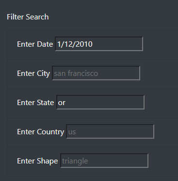
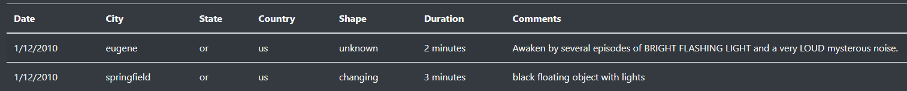

# Module 11 - UFO Sightings
## Overview
The goal of this project is to create a user-facing webpage that will load UFO sighting data into a table, and then allow users to filter the data on all columns.
## Results
Using the filters provided on the left-hand side of the page, users can input values corresponding to the available columns. If multiple input fields contain values, they will be filtered with `AND` logic. For example, if a user inputs values for `Date` and `State`:

The table will be filtered to show only rows matching *both* filter criteria:

To remove a filter, simply clear the input field, and the table will immediately update. **Note that the fields are case-sensitive**.
## Summary
While this design is great for filtering on distinct values, it cannot accept any date ranges or wildcards.  Furthermore, it assumes that `AND` logic is the only way users want to combine fields to search (instead of `OR`).

Here are a few recommendations for further development:
* Normalize the case of the text input so that values like "CA" and "ca" are identical to the filter.
* Use "From" and "To" date input fields to accept a range of values. If either field is empty, the ranges are unbound on that end. For example, "From: 1/1/2010 | To: 1/12/2010". 
* Add a radio button selector to let the user determine whether `OR` logic or `AND` logic is used to combine filters.